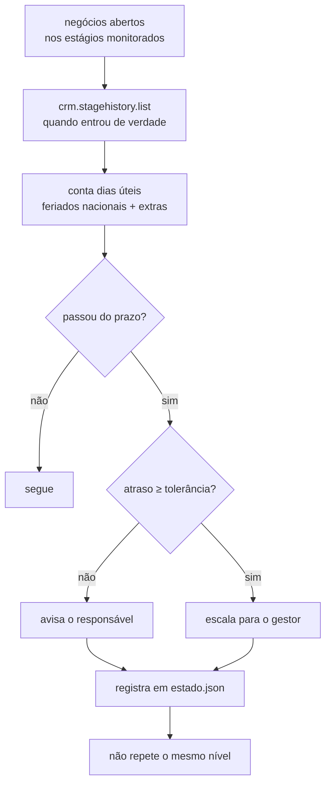

# bitrix24-deal-sla-watcher

Encontra negócios parados além do prazo no funil do Bitrix24 e cobra o
responsável — contando **dias úteis**, com feriado brasileiro móvel, e sem
virar spam.


---

## O problema

Todo funil tem negócio esquecido. O gestor descobre no fechamento do mês,
quando a proposta já perdeu a validade. As automações nativas do Bitrix
resolvem parte disso, mas esbarram em três coisas:

1. **Contam dias corridos.** Um negócio que entrou na sexta antes do Carnaval
   e continua parado na quarta de cinzas aparece como "5 dias parado". São
   zero dias úteis. Cobrar o vendedor nesse caso queima a confiança no robô —
   e um robô em que ninguém confia é o primeiro a ser desligado.

2. **Usam `DATE_MODIFY` como proxy de "tempo no estágio".** Qualquer edição
   atualiza esse campo. Um negócio abandonado há 40 dias cujo telefone foi
   corrigido ontem aparece como "modificado ontem" — e some do radar.

3. **Notificam todo dia.** Depois de uma semana, o time cria uma regra de
   caixa de entrada para o robô. A partir daí, o alerta que importava também
   some.

---

## Como resolve



**Feriado móvel sem tabela chumbada.** Carnaval, Sexta-feira Santa e Corpus
Christi saem da data da Páscoa pelo algoritmo de Butcher. Funciona em 2026,
2030 e 2043 sem ninguém atualizar arquivo — e sem dependência externa.
Feriados municipais e recessos entram por configuração, porque o aniversário
de São Paulo não para o time do Recife.

**Escalonamento em dois níveis.** Primeiro o responsável. Se o atraso passar
da tolerância, o gestor. Subir de nível conta como aviso novo — o gestor
ainda não tinha sido informado.

---

## Uso

```bash
pip install -e ".[dev]"
cp .env.example .env

vigiar-sla --config sla.json              # simula
vigiar-sla --config sla.json --executar   # notifica de verdade
```

Configuração:

```json
{
  "regras": [
    { "estagio_id": "C1:PREPARATION", "rotulo": "Proposta enviada",
      "dias_uteis": 5, "escalar_para": 42, "dias_para_escalar": 3 }
  ],
  "feriados_extras": ["2026-07-09"]
}
```

Saída:

```
3 negocios fora do SLA | R$ 87.400,00 parados
  #1042       6d de atraso  [gestor]       Reforma Ed. Aurora
  #1101       2d de atraso  [responsavel]  Obra Centro — fase 2
```

Sai com código **1** quando há violação, para o agendador falhar de forma
visível em vez de esconder o problema num log que ninguém abre.

---

## Decisões técnicas

**O tempo no estágio vem do histórico, não do negócio.**
`crm.stagehistory.list` guarda cada transição; a última entrada é o momento
que interessa. É uma chamada a mais por lote e resolve o furo que faz o
alerta silenciar justamente nos negócios mais mexidos.

**Estado do robô fica em disco, não no CRM.** Quem já foi avisado é controle
operacional, não informação de negócio. Escrever isso na timeline do cliente
é ruído para o vendedor que abre o registro esperando ver conversa.

**Salvamento atômico.** Grava em `.tmp` e faz `replace()`. Robô morto no meio
da escrita não pode deixar um JSON pela metade — na próxima execução isso
viraria "nunca avisei ninguém" ou um crash no `json.loads`.

**Estado corrompido não impede a varredura.** Se o arquivo não abrir, o robô
loga e recomeça do zero. O pior caso vira um aviso repetido; o alternativo
seria um SLA não cobrado, que é muito pior.

**A borda da contagem é exclusiva no início.** Entrou no estágio hoje = zero
dias úteis parado, não um. Off-by-one aqui cobra o vendedor no mesmo dia em
que ele recebeu o negócio.

---

## Testes

```bash
pytest -q
```

34 testes. Os do calendário conferem Páscoa contra datas conhecidas de cinco
anos e verificam que a semana do Carnaval de 2026 devolve **um** dia útil
entre sexta 13/02 e quarta 18/02. Os do vigia cobrem escalonamento,
anti-spam, estado corrompido e limpeza de negócios que saíram do estágio.

## Licença

MIT.
